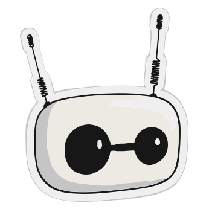
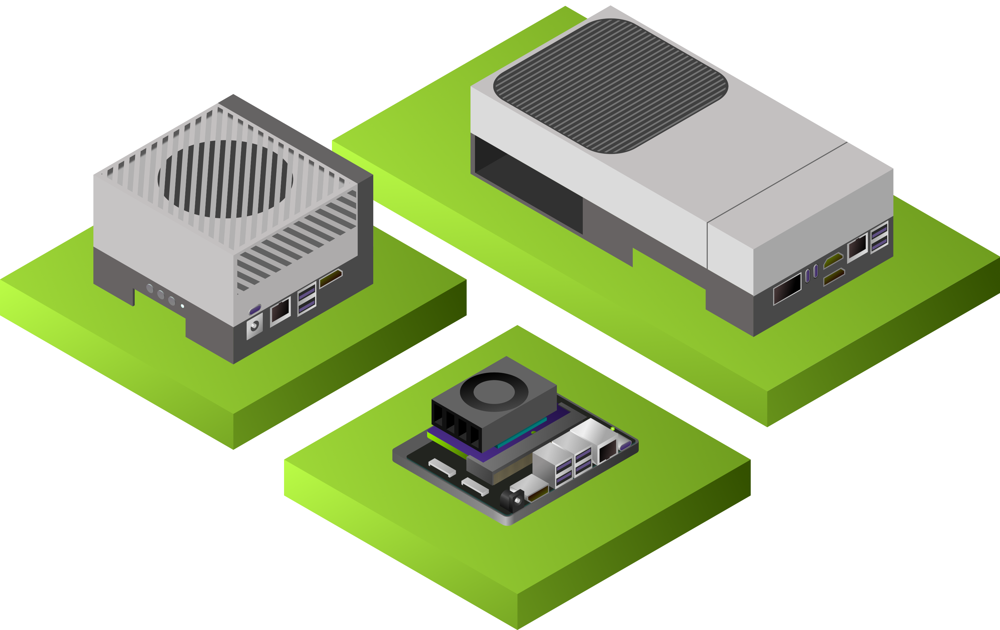

# Reachy Mini Jetson Assistant

<p align="center">
  <a href="https://www.pollen-robotics.com/reachy-mini/"></a>
  &nbsp;&nbsp;&nbsp;<b>x</b>&nbsp;&nbsp;&nbsp;
  <a href="https://developer.nvidia.com/embedded/jetson-orin-nano"></a>
</p>

A low-latency, fully on-device voice and vision assistant for [Reachy Mini Lite](https://www.pollen-robotics.com/reachy-mini/) powered by NVIDIA Jetson. Everything runs locally with GPU acceleration — no cloud, no API keys, no internet required at runtime.

> **Current target:** Jetson Orin Nano 8GB (JetPack 6.x, Python 3.10)
>
> AGX Orin and Thor support is planned — see [Roadmap](#roadmap).

## What It Does

Speak to Reachy Mini and it responds using a vision-language model that sees through its camera. The robot moves its head and antennas while it talks, and you can watch everything live through a browser-based UI.

```
[Mic] → [Silero VAD] → [faster-whisper STT] ──┐
[USB Camera] → [Frame Ring Buffer] ────────────┼→ [VLM stream] → [TTS stream] → [Speaker + Robot]
                                               └→ [Web UI via WebSocket]
```

## Demo

| Terminal | Web UI |
|----------|--------|
| Real-time STT, VLM streaming, timing stats | Live camera feed, conversation log, system monitor |

## Supported Modes

| Mode | Entry Point | Description |
|------|-------------|-------------|
| **Vision Chat** | `python3 run_vision_chat.py` | Camera + VLM + voice (terminal only) |
| **Web Vision Chat** | `python3 run_web_vision_chat.py` | Same as above + browser UI at `:8090` |
| **Voice Chat** | `python3 run_voice_chat.py` | Text LLM + optional RAG (no camera) |
| **Text Chat** | `python3 main.py chat -t` | Interactive text chat (no mic/speaker) |
| **CLI** | `python3 main.py ask "..."` | Single question, one-shot answer |

## Stack

| Component | Library | Acceleration | Notes |
|-----------|---------|:---:|-------|
| **VLM** | llama.cpp (Docker) | GPU | Cosmos-Reason2-2B GGUF, OpenAI-compatible API |
| **LLM** | llama.cpp (Docker) | GPU | Gemma 3 1B for text-only mode |
| **STT** | faster-whisper | GPU (CUDA) | CTranslate2 with CUDA, small.en default |
| **TTS** | Kokoro ONNX | GPU (CUDA) | Natural voices. Piper (CPU) as fallback |
| **VAD** | Silero VAD | CPU | Neural VAD, far better than energy-only |
| **Camera** | OpenCV V4L2 | CPU | 3 fps ring buffer, configurable resolution |
| **Robot** | Reachy Mini SDK | USB | Head pose, antennas, wake/sleep |
| **RAG** | ChromaDB + llama.cpp | GPU | bge-small-en-v1.5 embeddings (voice chat only) |
| **Web UI** | FastAPI + WebSocket | CPU | Live video, conversation stream, system stats |

## Prerequisites

### Hardware

- **NVIDIA Jetson Orin Nano** (8GB) — other Jetson modules may work but are untested
- **[Reachy Mini Lite](https://huggingface.co/docs/reachy_mini/platforms/reachy_mini_lite/get_started)** — the developer version, USB connection to your computer. Provides camera, microphone, speaker, and 9-DOF motor control in one cable. [Buy Reachy Mini](https://www.hf.co/reachy-mini/)
- **NVMe SSD** recommended — for swap space and model storage

If you're new to Reachy Mini, start with the [official getting started guide](https://huggingface.co/docs/reachy_mini/index) and the [Reachy Mini Lite setup](https://huggingface.co/docs/reachy_mini/platforms/reachy_mini_lite/get_started). The [Python SDK documentation](https://huggingface.co/docs/reachy_mini/SDK/readme) covers movement, camera, audio, and AI integrations.

### Software

- **JetPack 6.x** (L4T r36.x, Ubuntu 22.04, CUDA 12.6)
- **Python 3.10** (ships with JetPack 6 Ubuntu 22.04)
- **Docker** with NVIDIA runtime (`nvidia-container-toolkit`)
- **PulseAudio** (for mic/speaker multiplexing)

> **Important:** This project requires **Python 3.10** specifically. The Jetson ONNX Runtime GPU wheels, CTranslate2 builds, and Reachy Mini SDK are all built against Python 3.10 on JetPack 6. Using a different Python version will cause compatibility issues.

## Hardware Setup

### Reachy Mini Lite

1. Connect Reachy Mini Lite to your Jetson via USB. The robot provides camera, microphone, speaker, and motor control over a single USB connection.

2. Add udev rules so the SDK can access the robot's serial ports without root:

```bash
echo 'SUBSYSTEM=="tty", ATTRS{idVendor}=="2e8a", ATTRS{idProduct}=="000a", MODE="0666", SYMLINK+="reachy_mini"' \
  | sudo tee /etc/udev/rules.d/99-reachy-mini.rules
sudo udevadm control --reload-rules && sudo udevadm trigger
```

3. Add your user to the `dialout` group and reboot:

```bash
sudo usermod -aG dialout $USER
sudo reboot
```

4. Verify the device is visible:

```bash
ls -la /dev/ttyACM*
# Should show /dev/ttyACM0, /dev/ttyACM1, etc.
```

### NVMe Swap (Required for 8GB Jetson)

Running STT + VLM + TTS simultaneously exceeds 8GB RAM. Setting up swap on NVMe prevents OOM kills:

```bash
sudo fallocate -l 8G /mnt/nvme/swapfile   # adjust path to your NVMe mount
sudo chmod 600 /mnt/nvme/swapfile
sudo mkswap /mnt/nvme/swapfile
sudo swapon /mnt/nvme/swapfile

# Persist across reboots:
echo '/mnt/nvme/swapfile none swap sw 0 0' | sudo tee -a /etc/fstab
```

## Installation

### Step 1: System Dependencies

```bash
sudo apt-get update
sudo apt-get install -y \
  python3.10-venv \
  portaudio19-dev \
  libasound2-dev \
  pulseaudio-utils \
  libcudnn9-dev-cuda-12
```

### Step 2: Clone and Create Virtual Environment

```bash
git clone https://github.com/adsahu-nv/reachy-mini-jetson-assistant.git
cd reachy-mini-jetson-assistant
python3.10 -m venv venv
source venv/bin/activate
```

### Step 3: Install Python Packages

```bash
pip install --upgrade pip wheel
pip install -r requirements.txt
```

### Step 4: Install ONNX Runtime GPU (Jetson-Specific)

The default `onnxruntime` from pip is CPU-only. For GPU inference (Kokoro TTS, Silero VAD) on Jetson:

```bash
pip install onnxruntime-gpu --extra-index-url https://pypi.jetson-ai-lab.io/jp6/cu126
```

> If `CUDAExecutionProvider` isn't listed after install, uninstall the CPU version first: `pip uninstall onnxruntime && pip install onnxruntime-gpu --extra-index-url https://pypi.jetson-ai-lab.io/jp6/cu126`

### Step 5: Install Reachy Mini SDK

```bash
pip install reachy-mini
```

### Step 6: Pin NumPy (Compatibility Fix)

The Jetson `onnxruntime-gpu` wheel requires NumPy 1.x:

```bash
pip install "numpy==1.26.4"
```

### Step 7: Build CTranslate2 with CUDA (GPU-Accelerated STT)

The pip `ctranslate2` package is CPU-only. For GPU-accelerated speech-to-text on Jetson, build from source:

```bash
pip install pybind11

cd ~
git clone --depth 1 https://github.com/OpenNMT/CTranslate2.git
cd CTranslate2
git submodule update --init --recursive

mkdir build && cd build
export PATH=/usr/local/cuda/bin:$PATH
export CUDA_HOME=/usr/local/cuda
cmake .. -DWITH_CUDA=ON -DWITH_CUDNN=ON -DCMAKE_BUILD_TYPE=Release \
         -DCUDA_ARCH_LIST="8.7" -DOPENMP_RUNTIME=NONE -DWITH_MKL=OFF

make -j$(nproc)
cmake --install . --prefix ~/.local

export LD_LIBRARY_PATH=~/.local/lib:$LD_LIBRARY_PATH
cd ../python
pip install .
```

Persist the library path in your venv activation script:

```bash
echo 'export LD_LIBRARY_PATH=$HOME/.local/lib:$LD_LIBRARY_PATH' >> ~/reachy-mini-jetson-assistant/venv/bin/activate
```

### Verify Installation

```bash
source venv/bin/activate
python3 -c "
import ctranslate2; print('CTranslate2 CUDA devices:', ctranslate2.get_cuda_device_count())
import onnxruntime; print('ONNX providers:', onnxruntime.get_available_providers())
from reachy_mini import ReachyMini; print('Reachy Mini SDK: OK')
import faster_whisper; print('faster-whisper: OK')
import kokoro_onnx; print('kokoro-onnx: OK')
"
```

Expected output:
```
CTranslate2 CUDA devices: 1
ONNX providers: ['CUDAExecutionProvider', 'CPUExecutionProvider']
Reachy Mini SDK: OK
faster-whisper: OK
kokoro-onnx: OK
```

## Models

### LLM / VLM (served via llama.cpp Docker)

Models download automatically from HuggingFace on first launch. No manual download needed.

| Model | Use | Launch Command |
|-------|-----|----------------|
| Cosmos-Reason2-2B (Q4_K_M) | Vision VLM | `NP=1 ./run_llama_cpp.sh Kbenkhaled/Cosmos-Reason2-2B-GGUF:Q4_K_M` |
| Gemma 3 1B (Q8) | Text LLM | `./run_llama_cpp.sh ggml-org/gemma-3-1b-it-GGUF:Q8_0` |
| bge-small-en-v1.5 (Q8) | RAG embeddings | `./run_llama_embedding.sh ggml-org/bge-small-en-v1.5-Q8_0-GGUF:Q8_0` |

Models are cached in `~/.cache/huggingface` and reused across runs.

### TTS Voices

**Kokoro TTS** (default) downloads automatically on first run (~340 MB). No manual step needed.

To pre-download for offline use:

```bash
wget -P voices/ https://github.com/thewh1teagle/kokoro-onnx/releases/download/model-files-v1.0/kokoro-v1.0.onnx
wget -P voices/ https://github.com/thewh1teagle/kokoro-onnx/releases/download/model-files-v1.0/voices-v1.0.bin
```

**Piper TTS** (lighter CPU fallback, ~61 MB):

```bash
wget -O voices/en_US-lessac-medium.onnx \
  "https://huggingface.co/rhasspy/piper-voices/resolve/v1.0.0/en/en_US/lessac/medium/en_US-lessac-medium.onnx"
```

Switch TTS backend in `config/settings.yaml`:

```yaml
tts:
  backend: "kokoro"    # or "piper"
  voice: "af_sarah"    # kokoro: af_sarah, af_bella, am_adam, bf_emma, bm_george
```

## Usage

### Quick Start (Vision Chat with Web UI)

This is the recommended mode — VLM + camera + voice + browser dashboard:

**Terminal 1** — Start the VLM server:

```bash
NP=1 ./run_llama_cpp.sh Kbenkhaled/Cosmos-Reason2-2B-GGUF:Q4_K_M
```

Wait until you see `llama server listening at http://0.0.0.0:8080`.

**Terminal 2** — Start the assistant:

```bash
source venv/bin/activate
python3 run_web_vision_chat.py
```

Open `http://<jetson-ip>:8090` in a browser to see the live UI with camera feed, conversation log, and system stats. The robot listens through its microphone and responds via VLM + TTS.

Press **Ctrl+C** once to exit cleanly (robot will go to sleep position).

### Vision Chat (Terminal Only)

Same pipeline without the web UI:

```bash
NP=1 ./run_llama_cpp.sh Kbenkhaled/Cosmos-Reason2-2B-GGUF:Q4_K_M
# In another terminal:
source venv/bin/activate
python3 run_vision_chat.py
```

### Voice Chat (Text LLM, No Camera)

For text-only conversations with optional RAG:

```bash
./run_llama_cpp.sh ggml-org/gemma-3-1b-it-GGUF:Q8_0
# For RAG, also start the embedding server:
./run_llama_embedding.sh ggml-org/bge-small-en-v1.5-Q8_0-GGUF:Q8_0

# In another terminal:
source venv/bin/activate
python3 run_voice_chat.py           # with RAG
python3 run_voice_chat.py --no-rag  # without RAG
```

### CLI Commands

```bash
python3 main.py chat -t                        # interactive text chat
python3 main.py ask "What is the Jetson Orin?"  # single question
python3 main.py info                            # system info
python3 main.py rag-status                      # RAG index status
python3 main.py rag-search "GPU specs"          # search the knowledge base
```

### Test Robot Movement

```bash
python3 scripts/test_reachy_movement.py
```

### Stopping

```bash
# Stop the LLM/VLM Docker container:
docker stop assistant-llm

# Stop the embedding server (if running):
docker stop assistant-embed
```

## Web UI

The web UI (`run_web_vision_chat.py`) provides a real-time dashboard accessible from any browser on the same network:

- **Live camera feed** at 10 fps (independent of the 3 fps VLM ring buffer)
- **Conversation log** with streaming VLM responses
- **Push-to-talk** button (starts muted, click to unmute)
- **System stats** — CPU, GPU, RAM usage
- **Config panel** — displays active settings
- **Platform detection** — shows the specific Jetson model

Access at `http://<jetson-ip>:8090`. The web UI adds minimal overhead (~5 MB RAM).

## Configuration

All settings live in `config/settings.yaml`. Edit this file to tune behavior:

| Section | What It Controls |
|---------|-----------------|
| `llm` | LLM server URL, model, temperature, max tokens, system prompts |
| `stt` | Whisper model size, CUDA device, beam size |
| `tts` | Backend (kokoro/piper), voice, speed, chunking |
| `audio` | Sample rate, input device |
| `vad` | Silero threshold, silence duration, utterance filters |
| `vision` | Camera resolution, capture FPS, frames per query, VLM system prompt, few-shot examples |
| `reachy` | Robot connection, daemon behavior, wake/sleep on start/exit |
| `web` | UI FPS, host, port |
| `rag` | Embedding backend, knowledge directory, retrieval settings |

For developers adding new config fields, see `app/config.py` — typed dataclasses that define the schema and fallback defaults. The YAML always wins at runtime; the dataclass default is used if a key is missing from YAML.

## Project Structure

```
reachy-mini-jetson-assistant/
├── app/
│   ├── pipeline.py          # Audio I/O, VAD, TTS streaming, mic recording
│   ├── config.py            # Configuration dataclasses + YAML loader
│   ├── llm.py               # LLM/VLM client (OpenAI-compatible, multimodal)
│   ├── stt.py               # faster-whisper speech-to-text
│   ├── tts.py               # TTS backends (Kokoro GPU / Piper CPU)
│   ├── camera.py            # USB webcam ring buffer (OpenCV, V4L2)
│   ├── reachy.py            # Reachy Mini connection, daemon management
│   ├── web.py               # FastAPI + WebSocket server for browser UI
│   ├── monitor.py           # System resource monitoring (CPU/GPU/RAM)
│   ├── rag.py               # ChromaDB + embeddings retrieval
│   ├── audio.py             # PulseAudio / ALSA device helpers
│   └── cli.py               # Typer CLI (chat, ask, rag-*)
├── config/
│   └── settings.yaml        # All runtime configuration
├── static/
│   └── index.html           # Web UI (single-file HTML/CSS/JS)
├── scripts/
│   ├── bench_ttft.py        # VLM TTFT benchmark
│   ├── test_reachy_movement.py   # Robot movement test
│   └── test_vlm_prompts.py  # VLM prompt experiments
├── knowledge_base/          # Markdown docs for RAG
├── models/                  # Local GGUF models (gitignored)
├── voices/                  # TTS voice files (gitignored)
├── run_web_vision_chat.py   # Vision chat + web UI (recommended)
├── run_vision_chat.py       # Vision chat (terminal only)
├── run_voice_chat.py        # Voice chat with optional RAG
├── run_llama_cpp.sh         # Docker LLM/VLM server launcher
├── run_llama_embedding.sh   # Docker embedding server launcher
├── main.py                  # CLI entry point
└── requirements.txt         # Python dependencies
```

## Performance Notes (Orin Nano 8GB)

| Metric | Value |
|--------|-------|
| STT latency | ~0.7s (small.en, beam=1) |
| VLM TTFT (warm cache) | ~6–8s (Cosmos-Reason2-2B Q4_K_M) |
| VLM TTFT (cold) | ~8–10s |
| TTS latency (first chunk) | ~0.3s (Kokoro GPU) |
| End-to-end (speak → robot responds) | ~8–12s |
| Peak RAM | ~7.5 GB (STT + VLM + TTS + camera + web UI) |

The VLM vision encoder prefill is the primary bottleneck on Orin Nano. Flash attention (`-fa on`) and KV cache prefix reuse (`--cache-reuse 256`) are enabled in `run_llama_cpp.sh` to minimize repeated work across queries.

## Roadmap

- [x] Orin Nano 8GB — full pipeline validated
- [x] Web UI with live camera, conversation log, push-to-talk
- [x] Kokoro TTS GPU acceleration
- [x] Silero VAD for robust speech detection
- [x] KV cache reuse + flash attention for faster VLM TTFT
- [ ] **AGX Orin** — larger models (Cosmos-Reason2-7B, Gemma 3 4B), higher resolution, multi-turn context
- [ ] **Thor** — real-time VLM, multi-camera, extended context windows
- [ ] Multi-turn conversation memory
- [ ] Wake word detection (hands-free activation)
- [ ] Gesture recognition via camera
- [ ] Multi-language support

Contributions for AGX Orin and Thor testing are welcome.

## Troubleshooting

**Process won't exit / robot stays awake after Ctrl+C:**
The app handles Ctrl+C cleanly — the robot should go to sleep. If the process is stuck, run `pkill -9 -f run_web_vision_chat` and `pkill -f reachy-mini-daemon`.

**Port 8090 already in use:**
A previous instance is still running. Kill it: `lsof -ti :8090 | xargs kill -9`

**Camera not found:**
Check the device is available: `ls /dev/video*`. If another process holds it: `fuser -k /dev/video0`

**`CUDAExecutionProvider` not available:**
Uninstall CPU onnxruntime and reinstall the GPU version:
```bash
pip uninstall onnxruntime
pip install onnxruntime-gpu --extra-index-url https://pypi.jetson-ai-lab.io/jp6/cu126
```

**CTranslate2 not finding CUDA:**
Make sure the library path is set: `export LD_LIBRARY_PATH=$HOME/.local/lib:$LD_LIBRARY_PATH`

**VLM server not responding:**
Check the Docker container is running: `docker ps`. View logs: `docker logs assistant-llm`

## Reachy Mini Resources

| Resource | Link |
|----------|------|
| Getting Started | [huggingface.co/docs/reachy_mini](https://huggingface.co/docs/reachy_mini/index) |
| Reachy Mini Lite Setup | [Lite Guide](https://huggingface.co/docs/reachy_mini/platforms/reachy_mini_lite/get_started) |
| Python SDK Docs | [SDK Reference](https://huggingface.co/docs/reachy_mini/SDK/readme) |
| Quickstart | [First Behavior](https://huggingface.co/docs/reachy_mini/SDK/quickstart) |
| AI Integrations | [LLMs, Apps, HF Spaces](https://huggingface.co/docs/reachy_mini/SDK/integration) |
| Core Concepts | [Architecture & Coordinates](https://huggingface.co/docs/reachy_mini/SDK/core-concept) |
| Code Examples | [github.com/pollen-robotics/reachy_mini/examples](https://github.com/pollen-robotics/reachy_mini/tree/main/examples) |
| Community Apps | [Hugging Face Spaces](https://hf.co/reachy-mini/#/apps) |
| Discord | [Join the Community](https://discord.gg/Y7FgMqHsub) |
| Troubleshooting | [FAQ Guide](https://huggingface.co/docs/reachy_mini/troubleshooting) |

## License

MIT — see [LICENSE](LICENSE) for details.
